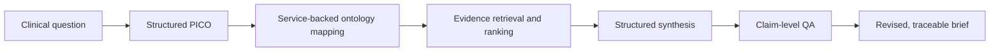

# EvidenceForge

EvidenceForge is an open-source research prototype that turns plain-English clinical
questions into structured, ontology-coded, evidence-backed briefs with claim-level
traceability. It is designed to make uncertainty, missing evidence, and model-generated
synthesis visible rather than presenting an opaque answer.

> EvidenceForge is not a medical device, is not for diagnosis, and does not provide
> individualized clinical advice. It does not replace clinical judgment.

## Project status

**Phase 0 — Foundation.** The package, typed settings, structured-logging foundation,
versioned API health contract, CLI, tests, and CI are operational. Clinical question
processing and terminology/evidence integrations are not implemented yet.

## Planned pipeline



## Local setup

Prerequisites: Git and [`uv`](https://docs.astral.sh/uv/). `uv` installs the required
Python 3.12 runtime when needed.

```bash
git clone <repository-url>
cd evidenceforge
uv sync --extra dev
uv run evidenceforge version
uv run evidenceforge serve
```

Open `http://127.0.0.1:8000/docs` for API documentation or call
`GET /api/v1/health`.

## Configuration

Copy `.env.example` to `.env` and override only the settings you need. Environment
variables use the `EVIDENCEFORGE_` prefix. Never provide PHI or commit credentials.

## Development

```bash
uv run ruff check .
uv run ruff format --check .
uv run mypy src
uv run pytest
```

The default tests are deterministic and do not call live or paid services.

## Architecture and safety

The package uses an application factory, typed environment settings, and separate API,
CLI, and configuration boundaries. Future terminology and evidence clients will be
async, allowlisted, and replaceable. See [architecture](docs/architecture.md),
[safety](docs/safety.md), and [security policy](SECURITY.md).

## Roadmap

- Phase 1: CLI question → PICO → live ICD-10-CM/RxNorm mapping → validated Markdown
- Phase 2: PubMed and ClinicalTrials.gov v2 retrieval and transparent ranking
- Phase 3: structured synthesis, claim-source linking, QA, and revision
- Phase 4: normalized persistence and stable API contracts
- Phase 5+: exports, interface, evaluation, and portfolio release

## License and contributing

Licensed under Apache 2.0. See [LICENSE](LICENSE) and
[CONTRIBUTING.md](CONTRIBUTING.md).

