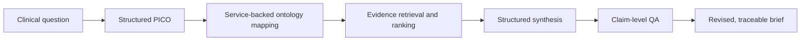

# EvidenceForge

EvidenceForge is an open-source research prototype that turns plain-English clinical
questions into structured, ontology-coded, evidence-backed briefs with claim-level
traceability. It is designed to make uncertainty, missing evidence, and model-generated
synthesis visible rather than presenting an opaque answer.

> EvidenceForge is not a medical device, is not for diagnosis, and does not provide
> individualized clinical advice. It does not replace clinical judgment.

## Project status

**Phase 6 — evaluation foundation.** The package includes the Phase 1
question-to-coded-Markdown slice, Phase 2 PubMed/ClinicalTrials.gov v2 retrieval, and
Phase 3 structured synthesis with claim-level QA and auditable revision. Phase 4 adds a
normalized SQLite schema, migrations, transactional artifact persistence, and stable
versioned API. Phase 5 now provides lossless JSON, metatagged Markdown, and reviewed PDF
exports through the API and CLI plus a Streamlit interface for inspecting completed
reviewed artifacts. Phase 6 now has a provenance-bearing evaluation contract,
deterministic metric engine, and cardiometabolic and rare-disease terminology-coded
seeds; full cross-domain evidence examples and the physician-reviewed benchmark remain
in progress. High-severity QA issues cannot auto-pass. The API currently ingests
completed validated artifacts; question-to-brief API orchestration remains later work.

## Planned pipeline



## Local setup

Prerequisites: Git, [`uv`](https://docs.astral.sh/uv/), and the Pango runtime used by
WeasyPrint. On macOS with Homebrew, run `brew install pango`; on Ubuntu, install
`libpango-1.0-0 libpangoft2-1.0-0 libharfbuzz-subset0`. `uv` installs the required
Python 3.12 runtime when needed.

```bash
git clone <repository-url>
cd evidenceforge
uv sync --extra dev
uv run alembic upgrade head
uv run evidenceforge version
uv run evidenceforge serve
uv run evidenceforge brief create \
  --question "In adults with neovascular age-related macular degeneration, how does aflibercept compare with ranibizumab for improving visual acuity?" \
  --confirm-no-phi \
  --output amd-coded-brief.md
```

Open `http://127.0.0.1:8000/docs` for interactive API documentation or call
`GET /api/v1/health`. See the [API contract](docs/api.md) and
[export contract](docs/exports.md), and [database design](docs/database.md).

In a second terminal, start the evidence-review interface:

```bash
uv run streamlit run streamlit_app/app.py
```

Open `http://127.0.0.1:8501` and enter a persisted brief UUID. The UI reads only the
configured EvidenceForge API origin and does not accept clinical free text. See the
[Streamlit interface guide](docs/streamlit.md).

On Apple Silicon, if WeasyPrint cannot locate Homebrew libraries, prefix PDF commands
with `DYLD_FALLBACK_LIBRARY_PATH=/opt/homebrew/lib`.

## Configuration

Copy `.env.example` to `.env` and override only the settings you need. Environment
variables use the `EVIDENCEFORGE_` prefix. Never provide PHI or commit credentials.

## Development

```bash
uv run ruff check .
uv run ruff format --check .
uv run mypy src
uv run pytest
```

The default tests are deterministic and do not call live or paid services. The CLI
terminology lookup is live and therefore requires network access.

Set `EVIDENCEFORGE_LLM_PROVIDER=openai` and `EVIDENCEFORGE_OPENAI_API_KEY` to use the
production OpenAI adapter. The default mock provider exists for the documented
[AMD](examples/ophthalmology/amd-coded-brief.md) and
[cardiometabolic](examples/cardiometabolic/type2-diabetes-coded-brief.md), and
[rare-disease](examples/rare_disease/myasthenia-gravis-coded-brief.md) examples and
tests; it is not a general clinical parser. The cross-domain artifacts are
terminology-coded questions only and do not make comparative efficacy claims.

The default suite contract-tests the OpenAI request/structured-response boundary without
a paid call. Run a credentialed integration smoke test separately before claiming a
specific model is operational in a deployment. Set
`EVIDENCEFORGE_OPENAI_REASONING_ENABLED=false` for models that do not accept reasoning
options; otherwise choose a supported `EVIDENCEFORGE_OPENAI_REASONING_EFFORT`.

The CLI requires an explicit `--confirm-no-phi` declaration and applies a limited
identifier-pattern screen before any external call. This is defense in depth, not a
guarantee that free text is de-identified. Never enter patient data.

Export an already persisted, reviewed brief without an external call:

```bash
uv run evidenceforge brief export \
  --brief-id 52f80aa8-2604-4f68-906a-66ac5678b7b8 \
  --format markdown \
  --output reviewed-brief.md
```

Score a validated, aligned evaluation run without an external call:

```bash
uv run evidenceforge evaluation score \
  --input evaluation-run.json \
  --output evaluation-report.json
```

Evaluation reports preserve dataset and reviewer provenance, system/model/prompt
versions, metric definitions and denominators, limitations, latency, cost basis, and an
input digest. A versioned
[draft question set](examples/evaluation/benchmark-question-set-v0.1.json) packages the
three existing cross-domain seeds for physician scope review without gold labels or
evidence-density claims. See the [evaluation design](docs/evaluation.md). No
physician-reviewed benchmark results are committed yet.

PubMed requests require `EVIDENCEFORGE_NCBI_EMAIL` so the client can send NCBI's
required maintainer contact parameter. `EVIDENCEFORGE_NCBI_API_KEY` is optional. Live
evidence checks are opt-in:

```bash
EVIDENCEFORGE_RUN_LIVE_INTEGRATION=1 uv run pytest tests/integration
```

## Architecture and safety

The package uses an application factory, typed environment settings, separate API and
CLI boundaries, and an injectable transactional repository. Terminology and evidence
clients are async, allowlisted, and replaceable. See [architecture](docs/architecture.md),
[database design](docs/database.md), [API v1](docs/api.md),
[export design](docs/exports.md),
[evaluation design](docs/evaluation.md),
[claim-level QA design](docs/qa-design.md), [safety](docs/safety.md), and
[security policy](SECURITY.md).

## Roadmap

- Phase 1: complete — CLI question → PICO → live ICD-10-CM/RxNorm mapping → validated
  Markdown
- Phase 2: complete — PubMed and ClinicalTrials.gov v2 retrieval and transparent
  ranking
- Phase 3: complete — structured synthesis, claim-source linking, QA, and revision
- Phase 4: complete — normalized persistence and stable API contracts
- Phase 5: complete — JSON/Markdown/PDF exports and Streamlit evidence-review interface
- Phase 6: in progress — deterministic evaluation contract, draft question-selection
  handoff, and cardiometabolic/rare-disease coded-brief seeds complete; full
  cross-domain evidence examples and physician-reviewed benchmark pending
- Phase 7: planned — portfolio documentation, release, and interview-ready walkthrough

## License and contributing

Licensed under Apache 2.0. See [LICENSE](LICENSE) and
[CONTRIBUTING.md](CONTRIBUTING.md).
