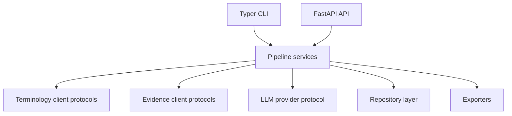

# Architecture

EvidenceForge is organized as independently testable stages. External terminology,
evidence, and LLM providers will sit behind typed interfaces; pipeline services will
depend on those interfaces rather than vendor SDKs.

Phase 0 intentionally contains only the delivery boundaries and runtime configuration.
An application factory keeps tests isolated and avoids hidden startup work.

