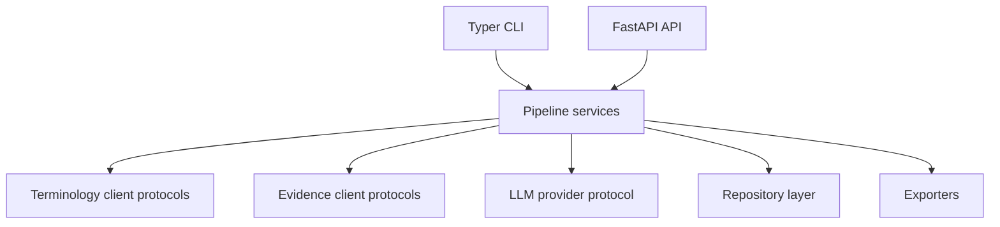
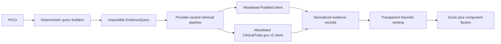

# Architecture

EvidenceForge is organized as independently testable stages. External terminology,
evidence, and LLM providers sit behind typed interfaces; pipeline services
depend on those interfaces rather than vendor SDKs.

Phase 0 intentionally contains only the delivery boundaries and runtime configuration.
An application factory keeps tests isolated and avoids hidden startup work.

## Evidence retrieval boundary

Query construction is deterministic and has no hidden network access. Source clients
own vendor response validation and normalization. Downstream stages consume only
normalized records and retained search metadata. Ranking is explicitly labeled as an
unvalidated retrieval heuristic; it does not claim to be a clinical evidence hierarchy.
Its caller-supplied reference year is retained with the result for reproducibility.
