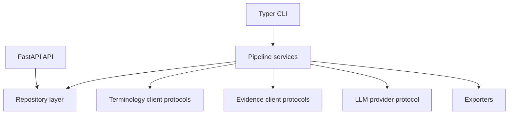
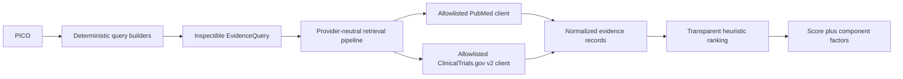
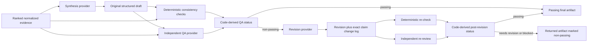
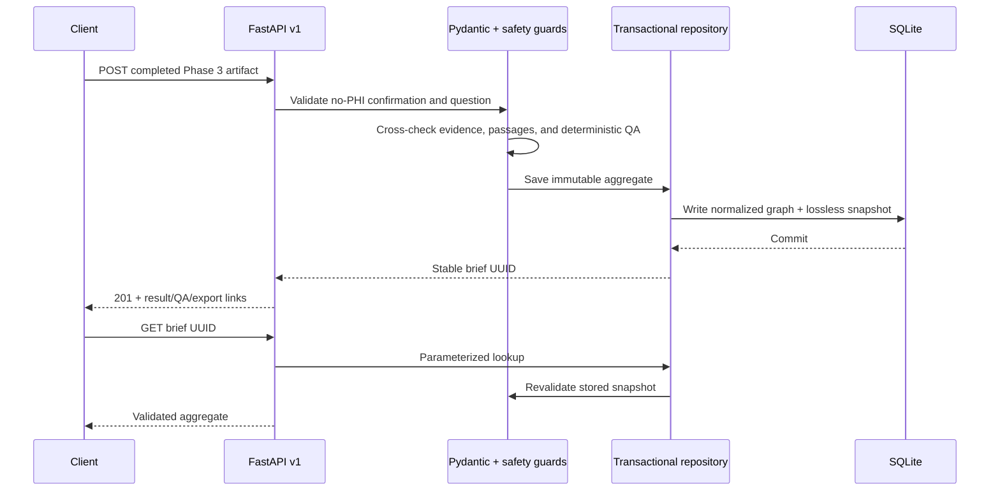
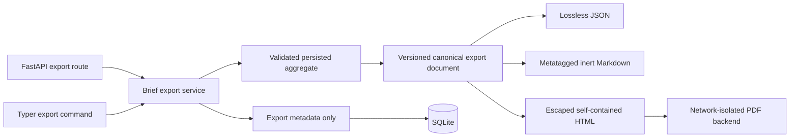

# Architecture

EvidenceForge is organized as independently testable stages. External terminology,
evidence, and LLM providers sit behind typed interfaces; pipeline services
depend on those interfaces rather than vendor SDKs.

Phase 0 intentionally contains only the delivery boundaries and runtime configuration.
An application factory keeps tests isolated and avoids hidden startup work.

## Evidence retrieval boundary

Query construction is deterministic and has no hidden network access. Source clients
own vendor response validation and normalization. Downstream stages consume only
normalized records and retained search metadata. Ranking is explicitly labeled as an
unvalidated retrieval heuristic; it does not claim to be a clinical evidence hierarchy.
Its caller-supplied reference year is retained with the result for reproducibility.

## Synthesis and claim-level QA boundary

The provider calls share a protocol but are separate injected dependencies. Structured
Pydantic models reject malformed outputs, and code—not a model—derives pass, revision,
or blocked status. All versions remain immutable. Questions, evidence, drafts, and QA
findings are serialized as untrusted user-prompt data and never inserted into
system-prompt authority. See [Claim-level synthesis and QA](qa-design.md).

## Persistence and API boundary

The current POST contract ingests a completed artifact; orchestration from a question
through external retrieval and synthesis is a later integration. Core provenance is
normalized while a validated aggregate snapshot preserves exact round-trip fidelity.
See [API v1](api.md), [database design](database.md), and
[ADR 0004](adr/0004-normalized-sqlite-persistence.md).

## Reviewed export boundary

The API and CLI share one service, so format selection cannot silently change the
underlying reviewed artifact. JSON is lossless; Markdown retains YAML metatags and the
human-readable provenance graph; PDF presents the reviewed subset with source IDs,
supporting passages, terminology provenance, QA, and revision history. PDF rendering
blocks resource fetches. Export bytes are not stored in SQLite, and the CLI does not
persist user-supplied file paths. See [reviewed brief exports](exports.md).
