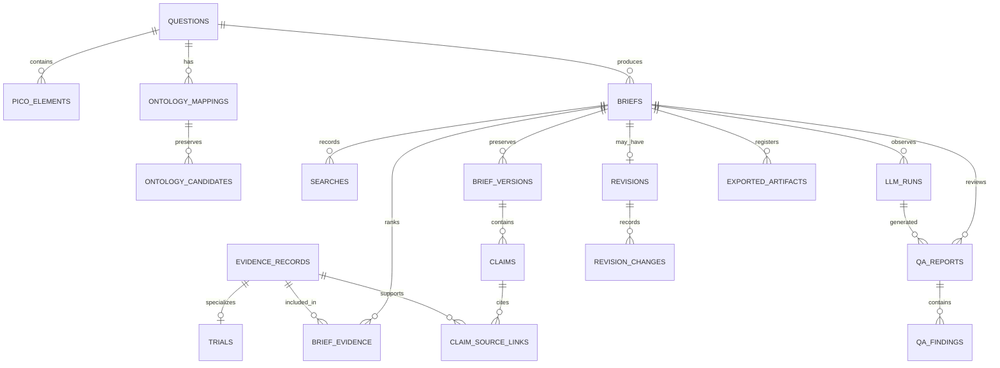

# Database

Phase 4 stores validated Phase 3 artifacts in SQLite through SQLAlchemy 2.x. Alembic is
the only supported schema-management path.

```bash
uv run alembic upgrade head
uv run evidenceforge serve
```

The default database is `./evidenceforge.db`. Override it with
`EVIDENCEFORGE_DATABASE_URL=sqlite:////absolute/path/evidenceforge.db`. Only
`sqlite:///` URLs are accepted during the MVP.

## Implemented relational tables

The uppercase labels below map one-to-one to tables created by the initial migration.
`ALEMBIC_VERSION`, which Alembic manages itself, is omitted.



The relational tables hold the queryable provenance graph. `briefs.aggregate_payload`
is a deliberate supplemental snapshot of the complete immutable artifact. Reads parse
that snapshot back through Pydantic, including evidence-reference, supporting-passage,
and deterministic-QA consistency checks.

Writes use one transaction. SQLite foreign-key enforcement is enabled on every
connection. A dedicated type rejects naive timestamps, normalizes aware values to UTC,
and restores UTC awareness after SQLite reads. Evidence records are intentionally
brief-scoped snapshots rather than globally unique canonical rows because upstream
records can change after a brief is reviewed. SQLAlchemy supplies parameterized access;
API brief identifiers are also validated as UUIDs before repository lookup.

Each successful API or CLI export adds an `exported_artifacts` row containing the
brief identifier, format, timestamp, and storage reference. The API records an inline
response marker; the CLI records a local-output marker but deliberately does not
persist the user-provided path, which could contain identifying information. Export
bytes are not stored in the database.

## Migration workflow

After changing mapped models:

```bash
uv run alembic revision --autogenerate -m "describe change"
uv run alembic check
uv run alembic upgrade head
uv run alembic downgrade -1
uv run alembic upgrade head
```

Review generated migrations before committing them. A schema change is incomplete
without a migration and upgrade/downgrade coverage.
