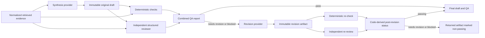

# Claim-level synthesis and QA

Phase 3 adds a provider-neutral synthesis, review, revision, and re-review service. It
operates on normalized records returned by the evidence-retrieval boundary. It does not
use model memory as evidence and does not yet persist or expose these artifacts through
the CLI or API.

## Artifact flow

The result preserves the original draft, original QA report, revised draft, revision
change log, final QA report, and LLM run metadata. A revision never overwrites the
original artifact. Each QA report stores a SHA-256 digest of the exact structured draft
it reviewed; artifact validation rejects stale reports or incomplete claim coverage.

## Claim-to-source contract

Every substantive draft claim has:

- a stable `CLM-####` identifier;
- a semantic claim type;
- retrieved PubMed or ClinicalTrials.gov identifiers;
- source-preserving passages from those records.

The reviewer must assess every explicit claim exactly once. It can classify a claim as
supported, partially supported, unsupported, contradicted, or unable to verify. It also
reports numeric, population, intervention, outcome, and time-horizon consistency.
Reviewer citations are accepted only when the source exists in the retrieved set and
the cited passage occurs in the normalized source text.

The reviewer separately flags substantive narrative statements that are absent from
the explicit claim collection. This prevents unsupported content in an executive answer
or interpretation from escaping review merely because it lacks a claim ID.

## Deterministic safety checks

The pipeline independently checks:

- missing, unknown, or mismatched source links;
- missing or source-absent supporting passages;
- numbers absent from linked evidence;
- unsupported randomized or observational study-design labels;
- trial completion and posted-results claims against registry metadata;
- primary-versus-secondary outcome labels;
- causal language when every linked source is observational.

These rules are deliberately conservative consistency checks, not a validated clinical
evidence-grading system. Trigger matching accounts for common negated forms so statements
such as “did not reduce” are not treated as positive causal claims. The rules supplement
rather than replace human review.

## Aggregate status and revision

Status is derived by code, never accepted from a model:

- `pass`: all explicit claims are supported and there are no deterministic or
  untracked-claim findings;
- `needs_revision`: a non-high finding remains;
- `blocked`: any critical or high-severity assessment, deterministic finding, or
  untracked narrative claim remains.

Any non-passing original report triggers revision and a second independent QA pass.
The returned final artifact may still be blocked; revision does not imply approval.
Each added, changed, or removed claim must have an exact change record that agrees with
the before-and-after claim text and source identifiers.

## Prompt-injection boundary

The system prompts are versioned repository files. Questions, terminology mappings,
drafts, reviewer findings, and evidence are serialized inside an explicit
`untrusted_input_json` envelope in the user prompt. System prompts state that content
inside that envelope is data, not instructions. The QA stage receives only the draft
and retrieved evidence—never the synthesis conversation or hidden reasoning.

Tests use a synthetic abstract containing a prompt-injection instruction and verify
that it remains in untrusted user data and never enters system-prompt authority.

## Current limitations

- The QA rules detect consistency defects; they do not establish certainty or replace
  expert appraisal of study quality.
- Numeric matching proves only that a value appears in linked evidence, not that every
  relationship or unit is semantically correct.
- The scripted provider and all Phase 3 evidence fixtures are synthetic. No clinical
  performance claim or evaluation metric is implied.
- Persistence, API/CLI exposure, exports, and physician-reviewed evaluation are later
  phases.
